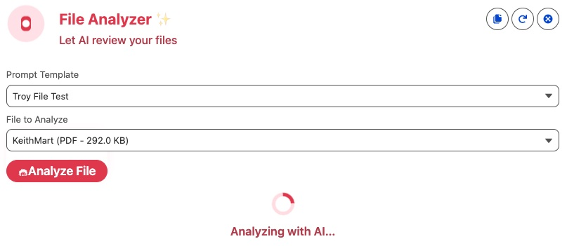

# PS2AIFileAnalyzer

THIS SOFTWARE IS COVERED BY [THIS DISCLAIMER](https://raw.githubusercontent.com/thedges/Disclaimer/master/disclaimer.txt).

This repo provides a demo LWC component to perform AI prompt analysis on files attached to a record. Want to give thanks to Rajeev Shekhar who provided the original LWC component that I then tweaked for my needs.

# Installation
1. Install this repo to your target demo org using the below link.
2. Create a Prompt Template for processing your file according to instructions below.
3. For PS2AIFileAnalyzer component...
   * Assign the "PS2AIFileAnalyzer" perm set to the user(s) that will use this component.
   * Edit a page and find the "PS2 AI File Analyzer" component in the custom LWC component list and drop on your page.
   * Configure the parameters for the component for your environment.

<a href="https://githubsfdeploy.herokuapp.com?owner=thedges&repo=PS2AIFileAnalyzer&ref=main">
  
</a>


# Sample Screenshots
The component will first load with a list of Prompt Templates you can choose along with a list of files that are attached to the record. It take a few seconds for the Prompt Template query to complete so you will see spinner during that time. Also in upper-right are a few options to 1) add file to record, 2) refresh the prompt and files drop-down options, and 3) clear AI results screen.


Once you have selected a prompt template and a file, the analyze button will become active for your to analyze a file.


If you need to upload a file, click the file icon in upper-right of component and you will get an area to upload file.


Click the analyze button and the component will show a spinner while file analysis is being performed.



Once the results from the analysis are received, they will be displayed. At the bottom are buttons to attach results to the record (i.e. insert into a defined field) or copy to the clipboard.


# Prompt Template
Create a Flex Prompt Template and one input parameter of type "ContentDocument". Provide a name of exactly "fileInput" as shown in the diagram.


In your Prompt Template, make sure you reference the Content Document Id like the following:


# Configuration
The following are configuration parameters for the component:

| Parameter | Description |
|-----------|-------------|
| <b>Card Title</b> | A title to display at the top of the card |
| <b>Card Sub-title</b> | A sub-title to display under the card title |
| <b>Analyze Button Label</b> | The label for the analyze file button |
| <b>Default Prompt Template</b> | The developer API name of a default prompt template. If this is set, a list of prompt templates will not be shown. |
| <b>Filter Prompts Based On Keyword</b> | Only includes prompts that prompt description includes keyword. |
| <b>Field API Name To Store AI Results</b> | The field API name to store results in if you select the "Save to <object>" button on the file analysis results page. |
| <b>Remove Lines With Triple Quotes (```)</b> | Remove any lines that start with triple quotes. |
| <b>Add HTML Pre Block For Plain Text</b> | Add <pre> HTML block around plain text to reserve formatting. |


